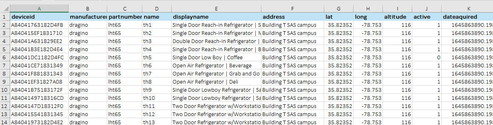
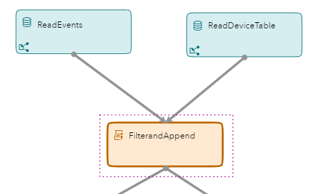
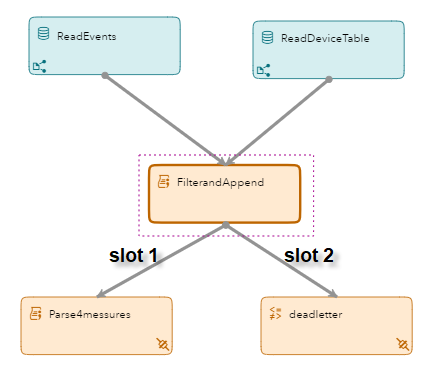
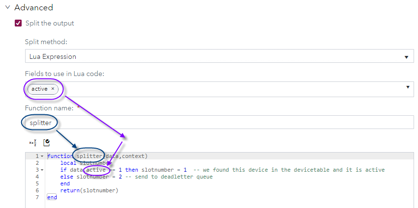
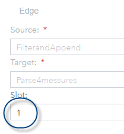
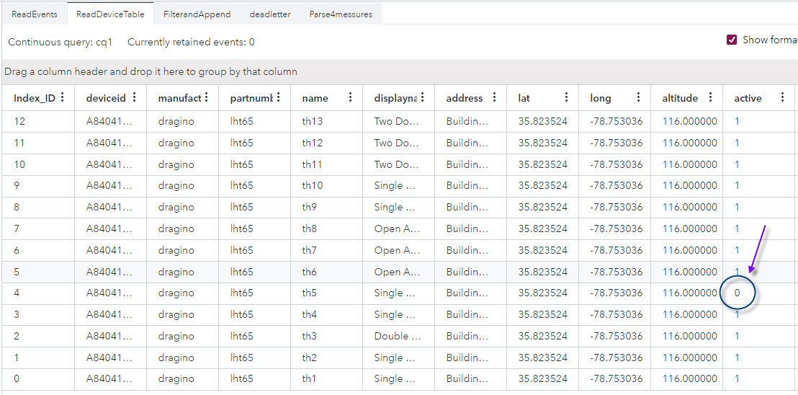
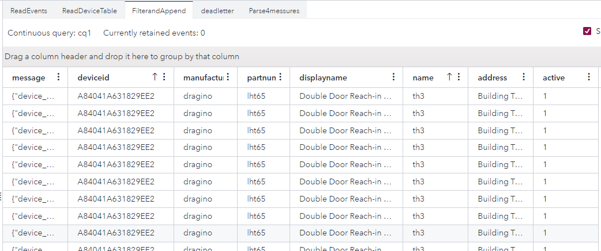
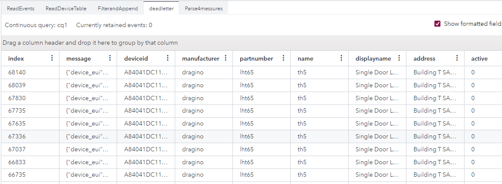
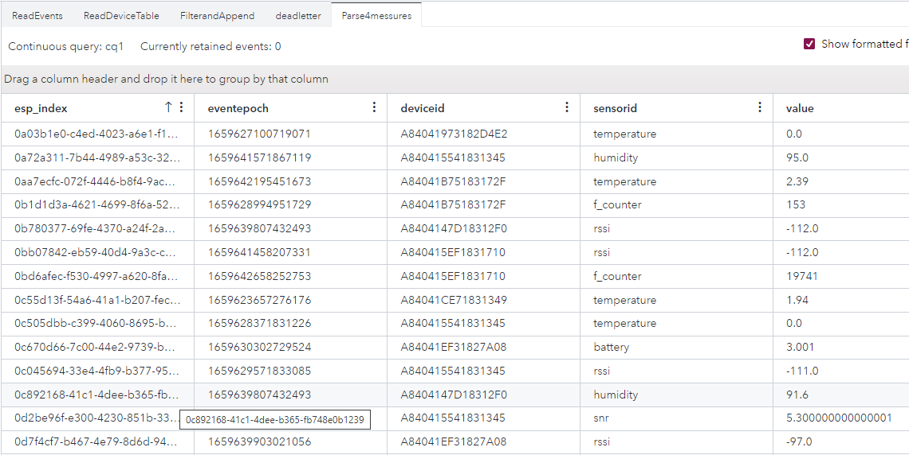

# Enhancing Sensor Data with a Device Table

This project will show how to import metadata from a device table and then use this information to enhance the incoming sensor events.  

## Table of Contents


* [Enhancing Sensor Data with a Device Table](#enhancing-sensor-data-with-a-device-table)
  * [Table of Contents](#table-of-contents)
  * [Overview](#overview)
  * [Event Data](#event-data)
  * [Device Table](#device-table)
  * [Filtering and Enhancing incoming data](#filtering-and-enhancing-incoming-data)
  * [Splitting the Output](#splitting-the-output)
  * [Checking out Work](#checking-out-work)
  * [Summary](#summary)
  * [Contributing](#contributing)
  * [License](#license)
  * [Additional Resources](#additional-resources)

## Overview

Let's say you have a data feed which contains sensor data from various devices around a college campus.  Devices such has water level sensors, temp and humidity, people counters etc.   Each device will contain many bits of information such as time stamps, location, and several sensors in a wide format.  All this is great information but we need to transform this information into something a bit more human readable so that it might be displayed on a user interface.  Next let's say you want to create a project that only considers data from "certain" devices.  Our data feed contains data from 100s of devices.  In our case, we want to create a project that only works on devices from one location.  

To accomplish these goals the following actions will need to be performed

- Read devices table and store values by key in memory
- Read device events from data source
- Join events by key
- Filter on events which match device table entries 
- Parse sensor values from wide format to tall

As you might have guessed from the project title we will use Lua windows in ESP to accomplish these actions.  In previous versions of ESP an Aggregate, Join and Functional window would be used.  

## Event Data

Our event data comes in as a JSON string which contains many elements.  

```json
{
  "device_eui": "A84041CE71831349",
  "device": {
    "manufacturer": "dragino",
    "part_number": "lht65",
    "label": "th6"
  },
  "version": 0,
  "radio": {
    "f_counter": 19264,
    "frequency": {
      "value": 903.1,
      "unit": "Hz",
      "scale": 6
    },
    "bandwidth": {
      "value": 125,
      "unit": "Hz",
      "scale": 3
    },
    "lns": {
      "name": "Everynet",
      "context": {
        "type": "uplink",
        "meta": {
          "network": "23fc46a1162e4a05a994dfc9cd1e15e5",
          "packet_hash": "2d10d17d65a4a98bdabe25c8a5dcc273",
          "application": "a000000000000100",
          "device_addr": "1798a51b",
          "time": 1658898838.913,
          "device": "a84041ce71831349",
          "packet_id": "6b52746f6a71b23aee300b0417d7f8c0",
          "gateway": "1c497bfa33c80000"
        },
        "params": {
          "payload": "y60BUwKyAX//f/8=",
          "port": 2,
          "duplicate": false,
          "radio": {
            "hardware": {
              "status": 1,
              "chain": 0,
              "tmst": 2307955612,
              "snr": -10.2,
              "rssi": -113,
              "channel": 2,
              "gps": {
                "lat": 35.823524475097656,
                "lng": -78.75303649902344,
                "alt": 116
              }
            },
            "datarate": 0,
            "modulation": {
              "bandwidth": 125000,
              "type": "LORA",
              "spreading": 10,
              "coderate": "4/5"
            },
            "delay": 0.00675201416015625,
            "time": 1658898838.8732562,
            "freq": 903.1,
            "size": 24
          },
          "counter_up": 19264,
          "rx_time": 1658898838.8732562,
          "encrypted_payload": "HYYFtSDJojYfmqg="
        }
      },
      "downlink": {
        "redis_key": "everynet:dn:A84041CE71831349"
      }
    },
    "rx_timestamp": "2022-07-27T05:13:58.873256+00:00",
    "type": "uplink",
    "modulation": "lora",
    "spreading_factor": 10,
    "gateways": [
      {
        "eui": "1c497bfa33c80000",
        "rssi": {
          "value": -113,
          "unit": "dBm"
        },
        "snr": {
          "value": -10.2,
          "unit": "dB"
        },
        "coordinates": {
          "altitude": 116,
          "latitude": 35.823524475097656,
          "longitude": -78.75303649902344
        }
      }
    ],
    "rssi": {
      "value": -113,
      "unit": "dBm",
      "extra": {
        "min": -113,
        "max": -113
      }
    },
    "snr": {
      "value": -10.2,
      "unit": "dB",
      "extra": {
        "min": -10.2,
        "max": -10.2
      }
    }
  },
  "data": {
    "f_port": 2,
    "rx_timestamp": "2022-07-27T05:13:58.873256+00:00",
    "payload_hex": "cbad015302b2017fff7fff",
    "sensors": [
      {
        "name": "battery",
        "value": 2.989,
        "unit": "V"
      },
      {
        "name": "temperature",
        "value": 3.39,
        "unit": "\\u00b0C"
      },
      {
        "name": "humidity",
        "value": 69,
        "unit": "%"
      }
    ]
  }
}
```

At the first level we have the following objects: 

- **device_eui**:   IEEE-64 Unique device identifier
- **device**:  manufacturer` and `part_number` of the device. Optional `label
- **version**:  Version of the JSON message structure
- **radio**: contains radio values
- **data**: contains sensor’s values

As you can see this JSON is quite complex, for now let's focus the device_eui variable because it will be used in our join with the device table.  Therefore, only the device_eui will be parsed from the JSON for our comparison.  Since this JSON is so complex a complete how to parse it will be covered in another project.  

## Device Table

Let's say you have a user interface that needs things like: 

- Location 
- Readable name
- Date Installed 
- In service flag

The sensor data coming from the device will not in most cases include this type of data nor should it.  This data likely changes very little  and would make incoming JSON payloads larger than needed.  Also, for devices in remote locations how would you ever update this information?  Unless, the device is remotely managed there is no real way to effectively manage this data.  For these reasons combining incoming data with metadata is essential.  For my little example, I have a csv file called Tfreezers.csv that looks as follows: 



Most of these fields are self explanatory, except perhaps the active flag.  I would like to use this flag to indicate whether a device is in service.  For example, if a device is known to have failed and needs replaced  the data coming off this device can not be trusted.   In this situation, you might turn the active flag to 0 so that data from this device is not forwarded.  

As stated earlier,  the data coming from the college campus includes sensors that we do not need to process in this project.  So the device table will also be used to filter events as well as enhance them.  

## Filtering and Enhancing incoming data

Our sample ESP project looks like this: 



There are 2 source windows.  One which will read campus sensor data as it is produced and one which will read our csv which contains the metadata described above.  All the records from the device table will need to be stored in ESP memory, also referred to as state, so that it can be joined with incoming events as needed.  Let's take a look at how this looks in the Lua code:

```lua
local devicetable = {}  -- store devicetable here

-- Take each record from the devicetable and build an internal table keyed by deviceid
local function builddevicetable(
    d,     -- table which contains one row read in by source window
    dt)    -- returns updated devicetable 
  if d.deviceid then -- ignore if null 
    dt[d.deviceid]={}  -- new tbl keyed by deviceid 
    dt[d.deviceid]["manufacturer"]=d.manufacturer
    dt[d.deviceid]["partnumber"]=d.partnumber
    dt[d.deviceid]["name"]=d.name
    dt[d.deviceid]["displayname"]=d.displayname
    dt[d.deviceid]["address"]=d.address
    dt[d.deviceid]["active"]=d.active
  end     
return (dt)
end 
function create(data,context)
    local event = {}
    if context.input == "ReadDeviceTable" then 
        builddevicetable(data,devicetable)   -- build state table 
        event = nil;  -- produce no event
    else         
      local parsedmessage = parseJson(data.message)
      local d_eui = parsedmessage["device_eui"]  
      if d_eui then  
        event.deviceid = d_eui
        if devicetable[d_eui] then 
          event.manufacturer= devicetable[d_eui]["manufacturer"]    
          event.partnumber  = devicetable[d_eui]["partnumber"] 
          event.name        = devicetable[d_eui]["name"]
          event.displayname = devicetable[d_eui]["displayname"]
          event.address     = devicetable[d_eui]["address"]
          event.active      = devicetable[d_eui]["active"]
        else event = nil;  -- filter non freezer events          
        end 
      end     
      
    end 
 return(event)
end
```

This code is all about building an in memory device table which stores our metadata.  To that end there is a function called builddevicetable.  

```lua
local devicetable = {}  -- store devicetable here

-- Take each record from the devicetable and build an internal table keyed by deviceid
local function builddevicetable(
    d,     -- table which contains one row read in by source window
    dt)    -- returns updated devicetable 
```

Note that our **devicetable** is created outside of our **create** function and therefore retains state.  For each row of the table read a table entry is created.  Because we want zero lookup time we are keying the table by devicedID.  Incoming events will use this key for direct access into this table.  

You may have noticed that there are 2 source windows.   The **context** variable allows for testing the source of the event.  Notice that the name of the source window is hard coded here.  So beware, if you change the name of the source window this statement will no longer match.  For records read from the device table, build the state table and produce no downstream events.   

```lua
if context.input == "ReadDeviceTable" then 
        builddevicetable(data,devicetable)  
        event = nil;
    else         
      local parsedmessage = parseJson(data.message)
```

By keying the device table by deviceID we now have a very easy way to join incoming events with metadata.   All that is needed is to parse out the device_eui string from the incoming event and use that as a key to the internal device table.  After which is just a matter of creating an event which contains both event data and metadata.  If the event does not match our device table the record is filtered and no event is created.  It is all done like this: 

```lua
else         
      local parsedmessage = parseJson(data.message)  -- parse JSON into lua table      
      local d_eui = parsedmessage["device_eui"]  -- grap the deviceID
      if d_eui then 
        event.deviceid = d_eui
        if devicetable[d_eui] then 
          event.manufacturer= devicetable[d_eui]["manufacturer"]    
          event.partnumber  = devicetable[d_eui]["partnumber"] 
          event.name        = devicetable[d_eui]["name"]
          event.displayname = devicetable[d_eui]["displayname"]
          event.address     = devicetable[d_eui]["address"]
          event.active      = devicetable[d_eui]["active"]
        else event = nil;  -- filter non freezer events 
        end 
      end     
```

So far this Lua window is performing the functions of aggregation, joining and filtering.   Next let's talk about handling the active flag which determines whether or not a device is in service. 

## Splitting the Output

We could have handled the active flag inside the main logic of the create function however just to change things up let's code a splitter function, in Lua of course, which sends events to different downstream windows by inspecting the active flag value.  For this use case I would like to send active events to a JSON parsing window and inactive events to a dead letter topic.  Our ESP project now looks like this: 



We want sensor events from active devices to be parsed while inactive events will simply be logged for later inspection.  The definition for the split function is found by expanding the Advanced section.  Select Lua Expression for the Split method if it is not the default.  Then code a splitter function as shown below.  The only field from the schema which needs to be passed to this function is the **active** flag.  Your function should return a slot number.  



The slot is now set.  Next we need to assign a slot to the edge which attaches to the correct windows.  Select the edge which connects Parse4messures and set its value to slot 1.  

		

Do the same for the deadletter edge and set it to slot 2.  We have now split our output based on whether the device table indicates that the device is active.  


## Checking out Work

Now let's test our work and see how we did.  By putting the project in test mode we can inspect the output schemas of the various ESP windows.  ReadEvents contains all the campus events that are streaming in. 


You can see the device table has been read in and device number 4 has the active flag set to zero.  



The FilterandAppend window shows only the devices which are listed in the device table as well as the addition appended metadata.  



The deadletter window contains only the out of service devices.



We can now work on parsing the sensor data for only the targeted devices.



## Summary

Lua is a very powerful addition to the ESP tool bag.  In a few lines of code we can read in and store data in memory.  Then use these values to filter and enhance incoming events.  For fun we split the output between active and inactive and sent them to the correct window for processing.  Lastly, we were able to parse device data into a tall sensor oriented data format.  

## Contributing

This project does not accept contributions.

## License

This project is licensed under the [SAS License Agreement for Corrective Code or Additional Functionality](LICENSE).

## Additional Resources

* [Lua Pattern Matching](https://riptutorial.com/lua/example/20315/lua-pattern-matching)
